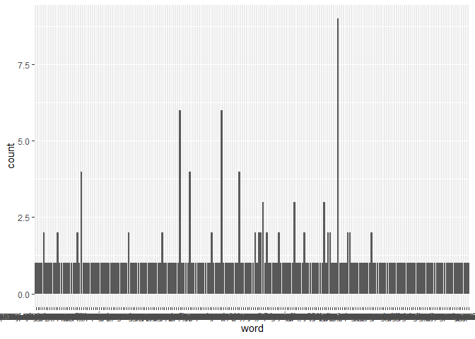

Proyecto n1

================

``` r
data <- read.csv(file.choose(), sep = ";", header= TRUE )
attach(data)
summary(data)
```

    ##      url               Local            Direccion            Precio         
    ##  Length:410         Length:410         Length:410         Length:410        
    ##  Class :character   Class :character   Class :character   Class :character  
    ##  Mode  :character   Mode  :character   Mode  :character   Mode  :character  
    ##                                                                             
    ##                                                                             
    ##                                                                             
    ##                                                                             
    ##  Ingredientes            nota          texto          
    ##  Length:410         Min.   :1.000   Length:410        
    ##  Class :character   1st Qu.:3.000   Class :character  
    ##  Mode  :character   Median :3.000   Mode  :character  
    ##                     Mean   :3.167                     
    ##                     3rd Qu.:4.000                     
    ##                     Max.   :5.000                     
    ##                     NA's   :8

``` r
#install.packages("tidyverse")
library(tidyverse)
```

    ## Warning: package 'tidyverse' was built under R version 4.0.5

    ## -- Attaching packages --------------------------- tidyverse 1.3.0 --

    ## v ggplot2 3.3.3     v purrr   0.3.4
    ## v tibble  3.0.3     v dplyr   1.0.5
    ## v tidyr   1.1.3     v stringr 1.4.0
    ## v readr   1.3.1     v forcats 0.5.0

    ## Warning: package 'ggplot2' was built under R version 4.0.4

    ## Warning: package 'tidyr' was built under R version 4.0.4

    ## Warning: package 'dplyr' was built under R version 4.0.4

    ## -- Conflicts ------------------------------ tidyverse_conflicts() --
    ## x dplyr::filter() masks stats::filter()
    ## x dplyr::lag()    masks stats::lag()

``` r
#filtrar las mejores hamburguesas. se filtraran las mejores hamburguesas para asi ver de primera cuales son las que tienen mejores calificaciones
mejores_hamburguesas<- filter(data, nota >= 5)


#separar los ingredientes de las mejores hamburguesas para de esta manera tener todos los ingredientes separados y poder ver cuales son los mejores
mejores_ingredientes<- strsplit(mejores_hamburguesas$Ingredientes, split=",") 
ingredientes_separados = data.frame(unlist(mejores_ingredientes))

#capitalizar los ingredientes para no tener tanto ruido en los datos
library(tools)
texto_columnas <-unlist(lapply(ingredientes_separados, FUN=toTitleCase))

#contando ingredientes que se repiten aqui se cuentan los ingredientes que mas se repiten para asi tener la frecuencia de estos
tabla <- table(texto_columnas)
tabla <- tibble(word = names(tabla), count = as.numeric(tabla))
tabla <- arrange(tabla, desc(count))
tabla
```

    ## # A tibble: 220 x 2
    ##    word                 count
    ##    <chr>                <dbl>
    ##  1 " Tomate"                9
    ##  2 " Lechuga"               6
    ##  3 " Palta"                 6
    ##  4 " Cebolla Morada"        4
    ##  5 " Mayonesa"              4
    ##  6 " Pepinillos"            4
    ##  7 " Queso Cheddar"         3
    ##  8 " Rúcula"                3
    ##  9 " Tocino"                3
    ## 10 " Ají Cherry Pepper"     2
    ## # ... with 210 more rows

``` r
library(ggplot2)
gg = ggplot(data  = tabla, aes(x=word, y=count))
gg + geom_bar(stat = "identity")
```

<!-- -->

``` r
#para la eleccion de la hamburguesa se utilizaran los primeros 9 ingredientes,pan de hamburguesa y hamburguesa ya que estas son por defecto las mas utilizadas en el mercado
hamburguesas<- filter(tabla, count>=3 )
hamburguesas
```

    ## # A tibble: 9 x 2
    ##   word              count
    ##   <chr>             <dbl>
    ## 1 " Tomate"             9
    ## 2 " Lechuga"            6
    ## 3 " Palta"              6
    ## 4 " Cebolla Morada"     4
    ## 5 " Mayonesa"           4
    ## 6 " Pepinillos"         4
    ## 7 " Queso Cheddar"      3
    ## 8 " Rúcula"             3
    ## 9 " Tocino"             3
